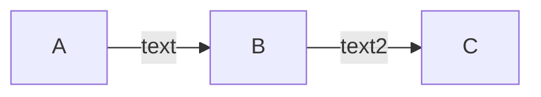

## Table of Contents

- [Introduction](#introduction)
- [Feature roadmap](#feature-roadmap)
- [Set Developer Environment](#set-developer-environment)

---
## Introduction

Omnis is a personal project for recruiters. 

---
## Architecture



---
## Feature roadmap

| Feature | Implementation | Documentation |
| --------- | - | - |
| [Authentication](https://cvmcosta.me/ltijs/#/provider?id=keyset-endpoint) | <center>✔️</center> | <center></center> |
| [Authorization](https://cvmcosta.me/ltijs/#/deeplinking) | <center>✔️</center> | <center></center> |
| [Meetings](https://cvmcosta.me/ltijs/#/grading) | <center>✔️</center> | <center></center> |
| [Recruitment](https://cvmcosta.me/ltijs/#/namesandroles) | <center>✔️</center> | <center></center> |

---


## Set Developer Environment

### DNS
In the environment variables and demo keycloack DB is used omnis.ca as DNS. Is required to fill it on /etc/hosts file.

```
...
192.168.0.199   omnis.ca
```

### Docker

```shell
$ docker compose up -d
```

### Environments 

You can fin a demo environments on folder environments. You can restore this environment following the next steps: 

```shell
$ cd scripts
$ ./restore.sh ~/Projects/omnis/environments/demo
$ cd ..
$ docker compose restart
```
### Get started

Once done below steps you can visit the following endpoints:

* Portal: [http://omnis.ca:3000]. User: demo, Pass: demo
* Gateway API Swagger: [http://omnis.ca:3001/api].
* Mongo Express: [http://omnis.ca:8081].
* Keycloak: [http://omnis.ca:8082].
* RabbitMQ: [http://omnis.ca:15672]. User: guest, Pass: guest

### Happy coding

You can open omnis folder with VS Code and edit the code. docker-compose file and dockerfiles are configure to debug the code and they have activated hot reload for client and server side.

Note: Watching files is working properly running Docker Desktop, other ways to run docker (Rancher Desktop or WSL) watching files is not working ver well. 